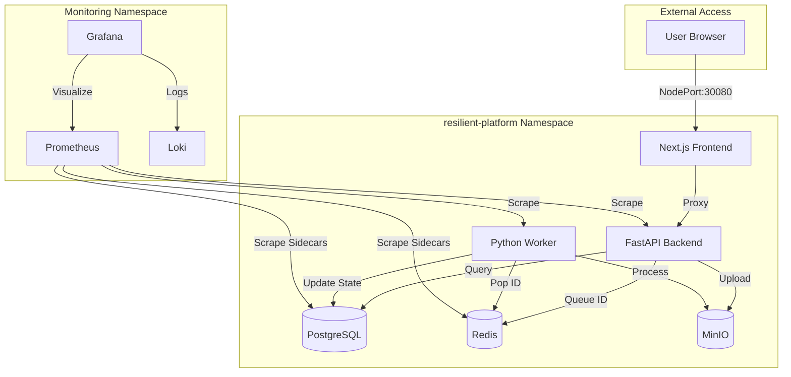

# 🌊 Resilient Async Job Processing Platform

[](https://kubernetes.io/)
[](https://istio.io/)
[](https://fastapi.tiangolo.com/)
[](https://nextjs.org/)
[](https://prometheus.io/)

An **Enterprise-Grade** asynchronous job processing system built for 100% resilience, observability, and security. Designed to handle large file processing (CSV/JSON) with zero data loss, even under cluster-wide failure.

---

## 🚀 Why this project?

Standard web applications fail when processing large files. Timeouts, pod crashes, and database deadlocks often lead to lost work. This platform solves that by:
- **Durably Persisting** every job state in PostgreSQL.
- **Decoupling** API from execution using Redis.
- **Enforcing Security** via Istio STRICT mTLS.
- **Monitoring Everything** with a dedicated Prometheus/Grafana/Loki stack.

---

## 🏗 System Architecture



---

## ✨ Key Features

- ✅ **Resilient Workers**: Jobs that fail are automatically retried with exponential backoff.
- ✅ **Strict mTLS**: All pod-to-pod communication is encrypted using Istio.
- ✅ **Object Storage**: High-performance S3-compatible storage via MinIO.
- ✅ **Deep Observability**: Pre-configured dashboards for CPU/RAM, Istio traffic, and DB health.
- ✅ **Schema Safety**: Automatic database migrations during deployment via Alembic.

---

## 🛠 Plug & Play Job Architecture

This platform is built for **extensibility**. You can plug in a new data processing function (e.g., custom JSON filtering, CSV enrichment, or log parsing) in under 5 minutes without touching the core infrastructure.

### How to add your own Job Type:
1.  **Define**: Add a new key to the `JobType` enum in the Backend.
2.  **Process**: Create a Python class inheriting from `JobProcessor` and write your logic (e.g., `MyCustomFilter`).
3.  **Register**: Drop your new class into the `registry.py` mapping.
4.  **UI**: Add a human-readable label in the Frontend `api.ts`.

> [!TIP]
> **Example**: Need to remove PII from JSON files? Just create a `JSON_PII_REMOVAL` processor, register it, and the UI will automatically show a "PII Removal" button for your users.

For a deep dive, see the **[Adding a New Job Type Guide](docs/backend/job-suggestions.md)**.

---

## 🚀 Quick Start (Minikube)

### 1. Prerequisites
- Minikube with `istio` and `ingress` addons enabled.
- `helm` installed.

### 2. Deploy the Infrastructure
```bash
# Install the Observability stack
helm repo add prometheus-community https://prometheus-community.github.io/helm-charts
helm install kube-prometheus-stack prometheus-community/kube-prometheus-stack -n monitoring --create-namespace

# Deploy the Platform
cd helm/resilient-platform
helm install resilient-platform . -n resilient-platform --create-namespace
```

### 3. Access the Apps
```bash
# Frontend
minikube service resilient-platform-frontend -n resilient-platform

# Grafana (Dashboards)
kubectl port-forward svc/kube-prometheus-stack-grafana 3001:80 -n monitoring
# (Visit localhost:3001 - Default creds: admin / prom-operator)
```

---

## 📊 Observability Showcase

This project includes "Day 2" operational readiness out of the box.

| Component    | Dashboard ID | Metrics Tracked                            |
| ------------ | ------------ | ------------------------------------------ |
| **Postgres** | `9628`       | Slow queries, DB size, active connections  |
| **Redis**    | `11835`      | Memory usage, cache hit rate, key eviction |
| **MinIO**    | `13502`      | S3 API latency, throughput, bucket trends  |
| **Cluster**  | `315`        | Resource saturation per node/pod           |

---

## 📂 Project Structure

- `/backend`: FastAPI service & SQLAlchemy models.
- `/frontend`: Next.js React application with Tailwind CSS.
- `/helm`: Production-ready Kubernetes manifests.
- `/docs`: Deep dives into Istio, Monitoring, and API Contracts.

---

## ⚖️ License
[MIT](LICENSE) - Built for educational best practices in cloud-native engineering.